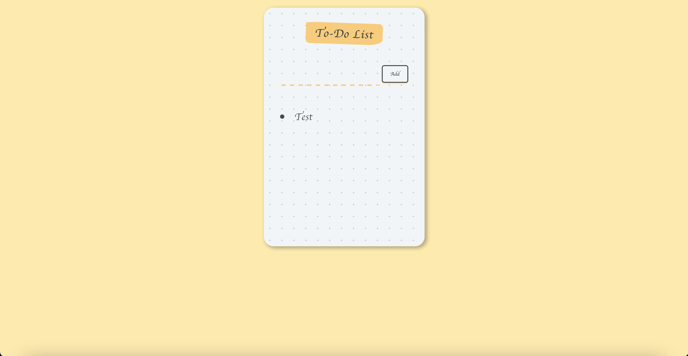

# ToDo List App

For this Application was used the following technologies:

* [React Framework](https://reactjs.org)

For the Frontend was used the following tecnologies:
* [HTML5](https://www.w3schools.com/html/)
* [CSS Bootstrap](https://getbootstrap.com/docs/5.0/getting-started/introduction/)
* [JavaScript](https://devdocs.io/javascript/)
* [JQuery](https://api.jquery.com/)

The 1.0 Version the Aplication can do the requisitions:
- Add a new task
- Keep tasks
- Delete tasks

